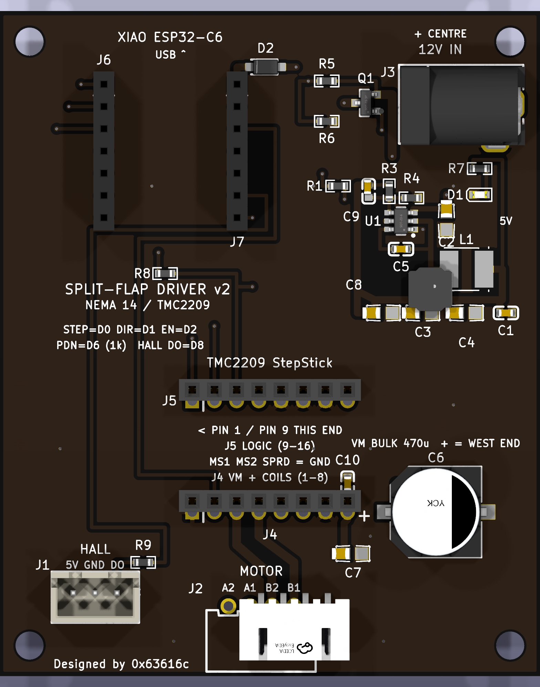

# split-flap driver board v2 — NEMA 14 / TMC2209

Single-module driver for the split-flap: a socketed **Seeed XIAO ESP32-C6**
drives a socketed **TMC2209 SilentStepStick**, which drives a 4-lead bipolar
**NEMA 14** (0.6 A/phase, 1.8°). The whole module — motor, logic and hall
sensor — runs from **one 12 V barrel jack**.

62 × 76 mm, 2-layer, 1.6 mm FR4. Fits behind a module with room to spare
(the unit plate is 95 × 118 mm).

v1 (`../driver-board/`) is the 28BYJ-48 board — it drove a ULN2003 off USB 5 V.
This is a separate design, not a revision of it. (v1 has had exactly one change
made to it since: its XIAO socket was the same male-header part as this board's
was, and was swapped for a female receptacle.)



## Pinout

XIAO pin assignment is the one `firmware/micropython-spike/tmc_spin.py`
already uses. The hall wiring is carried over from the v1 bench, with a 1 kΩ
series resistor added.

| XIAO | Signal | Goes to |
|---|---|---|
| D0 | STEP | StepStick pin 10 |
| D1 | DIR | StepStick pin 9 |
| D2 | EN | StepStick pin 16 (active **low**; the module pulls it up, so the driver is off until firmware drives it) |
| D6 | PDN_UART | StepStick pin 11, through a 1 kΩ series resistor (R8) |
| D7 | PDN_UART **read** | the same net as D6. D7 is GPIO17 = U0RXD, so the UART can be read as well as written |
| D8 | HALL DO | J1 pin 3, through a 1 kΩ series resistor (R9) |
| 5V | +5 V in | fed **by the on-board buck** through D2, not by USB |
| 3V3 | +3.3 V out | StepStick VIO — this is what sets the driver's logic level |

D3/D4/D5/D9/D10 are socketed but unrouted.

> **The hall line floats when no magnet is present.** An open-collector
> output is high-Z when it is not pulling down, and nothing on this board
> pulls it up. Firmware **must** enable the XIAO's internal pull-up on D8 or
> it will read noise.

### StepStick socket (J5 = pins 9–16, J4 = pins 1–8)

Pin numbering follows the Trinamic *TMC2209 SilentStepStick* hardware manual
(doc rev 1.20). Note this is **not** the naive A4988 column order — the coils
are on the same side as VM, and the header does not carry DIAG or INDEX (those
are module pads 17/18).

```
J4 (pins 1-8)   GND  VIO  M1B  M1A  M2A  M2B  GND  VM
J5 (pins 9-16)  DIR  STEP PDN  UART SPRD MS2  MS1  EN
```

MS1, MS2 and SPREAD are tied to GND: UART address 0 and StealthChop.
Microstepping and run current are set over UART, not by jumpers.

Pin 12 (UART) is left unconnected. The reason is **not** that the module has
its own series resistor on it — it does not; the SilentStepStick fits a 20 kΩ
**pull-down** (R1) there. The reason is that pins 11 and 12 are the two ends
of the module's 3-way solder jumper JMP, and our 1 kΩ (R8) already provides
the series resistance the single-wire UART needs. Driving both ends would
just fight the jumper.

> ### ⚠ Bridge JMP to PDN before UART will do anything
>
> The SilentStepStick ships with **neither** side of JMP bridged: JMP.1 goes
> to pin 11 (PDN) and JMP.3 to pin 12 (UART), and out of the factory the pad
> is open. Until you bridge JMP to the **PDN** side, the driver never sees
> anything the XIAO sends — it silently runs STEP/DIR at its default 1/8
> microstep with the current set by the on-board trim pot, and every UART
> write is a no-op with no error.

### Connectors

| Ref | Type | Pinout (left → right as silkscreened) |
|---|---|---|
| J3 | 5.5 × 2.1 mm barrel, 3 A | **centre positive**, 12 V — **meter tip/sleeve before first power-up**, see below |
| J2 | JST-XH 4-pin, right angle | `A2 A1 B2 B1` — the connector is rotated, hence the reversed order. Labels follow the **driver's** coil naming: on a SilentStepStick M1 is coil B and M2 is coil A, so J2's `A` pair goes to the driver's M2 |
| J1 | JST-XH 3-pin, vertical | `5V GND DO` |

> **Meter J3's tip and sleeve before you apply 12 V.** DC-005 pad numbering is
> not standardised between vendors, and the two pads of the rear row are
> geometrically identical, so there is nothing to tell them apart by eye. The
> pin functions in `parts/DC_005C/DC_005C.ato` are derived by structural
> correspondence with the previous jack, not read off a datasheet — sound
> reasoning, but still an inference. Put a meter on a plugged-in barrel
> connector and confirm tip → J3 pad 1 and sleeve → J3 pad 2 first.

## Power

```
12V jack ──> Q1 (P-FET reverse-polarity gate) ──> +12V rail
                                                   ├─> StepStick VM  (C6 470uF + C7 22uF + C10 100nF)
                                                   └─> U1 TPS563201 ──> +5V ─┬─> hall sensor
                                                                             └─> D2 ──> XIAO 5V pad
XIAO 3V3 out ──> StepStick VIO
```

**Budget** — a 12 V ≥ 2 A brick covers it with margin:

| Load | Draw |
|---|---|
| Motor, 2 phases × 0.6 A into the coils | ~6–9 W → **0.5–0.75 A** at 12 V (coil resistance not in the listing; assumed 8–12 Ω — measure it) |
| XIAO ESP32-C6 (WiFi peaks) | ~0.5 A at 5 V → ~0.25 A at 12 V |
| Hall module | ~20 mA at 5 V |
| **Total** | **~1.0–1.3 A at 12 V** |

J3 is a DC-005C-20A, rated **3 A**. The 1 A-rated DC-005 this board first used
was at or over its limit continuously against that budget.

**VM bulk.** C6 is 470 µF / 25 V with 80 mΩ ESR and an 850 mA ripple rating,
sitting directly beside the StepStick's VM pin, with a 22 µF ceramic (C7)
alongside it for the mid-band and a 100 nF (C10) 2.5 mm from the VM pad itself
for the high-frequency edge — neither of the larger parts is a short at the
tens-of-MHz edges the TMC2209's gate drive puts on VM. The TMC2209 chops the
full coil current out of VM; undersizing this is the classic way to kill the
driver.

**Reverse polarity.** Worth it — barrel bricks vary and the TMC2209 does not
survive reverse VM. A high-side P-FET rather than a series Schottky: the diode
would drop ~0.4 V and burn ~0.4 W at 1 A, and eat the buck's headroom, where
the FET is ~50 mΩ (≈50 mV).

*Orientation.* A P-FET's body diode conducts **drain → source**, so for this to
block on reverse input the drain has to face the jack and the source the
protected rail — which is how Q1 is wired. Getting it the other way round is
not a no-op, it quietly defeats the whole circuit: with the source on the jack
side the body diode's anode faces the load, stays forward-biased under reverse
input, and conducts anyway, putting roughly **−11.3 V** across C6. An earlier
revision of this board had exactly that.

*Gate.* Not tied to GND — the AO3401A is only rated V<sub>GS</sub> ±12 V, which
a 12 V brick sits right on. R5/R6 (100 k/56 k) hang off the **source** (the
gate is referenced to the source, so the divider follows that pin) and park the
gate at 0.64 × V<sub>source</sub> below it: −7.7 V at 12 V in, −9.6 V even at a
15 V brick. Fully enhanced, safely inside the rating. On power-up the body
diode pulls the rail to V<sub>in</sub> − 0.7, which is what gives the divider a
live source to work from; the drop then collapses to I × R<sub>DS(on)</sub>.

**Buck.** TPS563201, 4.5–17 V in, 3 A, D-CAP2 — no external compensation and
no catch diode. V<sub>out</sub> = 0.768 × (1 + 54.9 k/10 k) = **4.99 V**.

*Cff.* R3 carries a 100 pF C0G in parallel (C9). A high-V<sub>out</sub> D-CAP2
converter on an all-ceramic output has very little phase margin at crossover;
TI's SLVAF45, *Why We Need Cff in High Output Voltage D-CAP2/3 Converter for
Stability*, works this exact 12 V → 5 V case and measures phase margin going
from **17.2° to 75.4°** once Cff is fitted. The 54.9 k/10 k pair is TI's from
that note, which is why it is 54.9 k and not 56 k.

*Output capacitance.* TI's stable window is 20–68 µF **effective**. A 22 µF
25 V X5R 0805 loses roughly half its value to DC bias at 5 V, so the two caps
this board originally carried gave ~20–24 µF — sitting on the floor of the
window with tolerance and temperature able to push it under. There are now
three (C3/C4/C8), for ~30–36 µF derated.

*EN.* A plain 100 k pull-up to the 12 V rail. Earlier revisions fitted a
100 k/56 k divider justified as a level-shift for a 6 V abs-max on EN; that
was wrong — SLVSD90B rates EN at abs-max **19 V**. It was not a useful UVLO
either (it releases at V<sub>in</sub> ≈ 3.3 V, below the part's own 4.5 V
minimum), so the low side is gone.

**Trace widths.** Motor coils, the 12 V spine and VM run at 1.0 mm; 5 V and
the buck power nets at 0.8 mm (0.6 mm where they escape the SOT-23-6); logic
at 0.4 mm. 1.0 mm on 1 oz outer copper carries ~2.5 A at a 10 °C rise, against
a ~0.85 A peak coil current.

**12 V and USB together.** The XIAO ESP32-C6's 5V pad is the *same net* as its
USB VBUS, with no series diode anywhere on the module (Seeed schematic v1.0).
Wired straight through, plugging in USB while 12 V was applied would have the
buck driving the host PC's VBUS rail backwards down the cable. **D2**, a
B5819W Schottky, makes that path one-way, so both supplies may be present at
once.

D2 sits between the buck and the socket *only*. Everything else on the board —
including the hall connector — taps the rail upstream of it, because the A3144
wants ≥ 4.5 V and would be marginal at 4.99 − 0.3 = 4.69 V. The XIAO's own
regulator is perfectly happy at 4.69 V.

## What to order

`fab-splitflap-driver-nema-v2.zip` → PCBWay, 2-layer, 1.6 mm FR4, HASL or ENIG,
any colour. It conforms comfortably to their standard 2-layer capability:

| Constraint | PCBWay standard | This board |
|---|---|---|
| Min trace / space | 6 mil (0.152 mm) | **15.7 mil (0.4 mm)** trace, 0.2 mm space |
| Min drill | 0.3 mm | **0.3 mm** (vias); smallest THT 0.8 mm |
| Min annular ring | 0.13 mm | **0.15 mm** |
| Min silkscreen width | 0.15 mm | **0.15 mm** — normalised at place time |
| Solder mask expansion | — | 0.05 mm |
| Board thickness | 1.6 mm | 1.6 mm |
| Layers | 2 | 2 |
| Outline | — | 62 × 76 mm, four 3.2 mm M3 holes |

The four M3 mounting holes are real **NPTH pads**, so they appear in
`filled-NPTH.drl` and get drilled to drill tolerance. They used to be inner
Edge.Cuts circles: a fab does cut those, but the non-plated drill file came out
empty, so nothing in the package actually declared them as holes.

Components: `bom.csv` — every part is LCSC-stocked and pinned by part number.
The three items under *not fitted* (StepStick, XIAO, 12 V PSU) are ordered
separately; the XIAO and StepStick plug into sockets and are not soldered down.

## Assembly notes

Everything is hand-solderable: 0603/0805 passives, SOT-23 and SOT-23-6, and
through-hole connectors. Suggested order — SMD first, tallest THT last:

1. **U1 (TPS563201)** and **Q1** — easiest with nothing else in the way.
2. 0603/0805 passives. **C6 (470 µF) is polarised**: pin 1 is +, and the silk
   marks the negative half. **D1** is polarised too.
3. Sockets J4–J7 (**female** receptacles — the modules bring the male pins).
   Seat them square; a tilted socket makes the modules sit crooked. The two
   sockets do **not** share a row spacing:
   - **XIAO J6/J7 — 15.24 mm** (0.6 in). The module's pin rows really are
     0.6 in apart.
   - **StepStick J4/J5 — 12.70 mm** (0.5 in). The 0.6 × 0.8 in figure quoted
     for a StepStick is its *board outline*; the pin rows are inset 1.27 mm
     from each long edge, so centre-to-centre is 15.24 − 2 × 1.27. A first
     spin of this board used 15.24 mm here and the module would not seat.
     `tools/place_and_render.py` now asserts both pitches at place time.
4. Connectors J1, J2, J3 last.

Then, before plugging anything in:

- Apply 12 V and check **D1 lights** and the XIAO's 5V pin reads ~5.05 V.
- Confirm 3V3 is live on the socket before inserting the StepStick — VIO comes
  from the XIAO, so the driver must never be powered without the XIAO fitted.
- **Set the StepStick's V<sub>ref</sub> pot before running the motor.** The
  board does not break V<sub>ref</sub> out; use the module's own trim pot and
  creep the current up from minimum, per the note in `tmc_spin.py`. On a Watterott-style
  module (0.11 Ω sense, 1.77 A RMS at full scale) 0.6 A/phase RMS works out at
  V<sub>ref</sub> ≈ 0.85 V — but clones vary in sense resistor, so verify
  against your module before trusting that number.
- Insert the StepStick with **pin 1 / pin 9 at the end marked on the silk**.
  Both rows are identical 1×8 headers, so the arrow and the row labels
  (`J4 VM + COILS`, `J5 LOGIC`) are the only thing stopping a 180° insertion,
  which is destructive.
- **Bridge the StepStick's JMP jumper to the PDN side** if you want UART. See
  the note under *StepStick socket* above — it is unbridged from the factory
  and UART does nothing at all until you bridge it.
- **C6 is polarised and its silk is counter-intuitive.** The footprint's
  chamfer marks the **positive** end, which is the opposite of what you get
  reading the can's own stripe. Go by the `+` glyph on the silk at C6's west
  end, or by pad 1.

## Building this from source

```
ato build                                    # twice after adding a component
tools/build_outputs.sh                       # place, route, DRC, renders, fab
tools/build_outputs.sh --quick               # place + DRC only
```

Placement and routing are address-keyed data tables in
`tools/place_and_render.py`, so they survive designator reshuffles. It also
self-checks placement numerically (body overlap, off-board, pad-to-pad) before
writing anything.

atopile's cloud registry was down, so all parts are vendored locally:
`tools/vendor_part.py <LCSC> <DIR>` (easyeda2kicad → faebryk `kicad.convert`),
then `tools/trim_lib_silk.py` clips silkscreen out of pads. Run the trim once
per vendoring — it is not idempotent across repeated runs.

### DRC status

> ### ⚠ Do not run DRC on `layouts/default/default.kicad_pcb`
>
> That file is atopile's, and it ships with the GND zones **unfilled**. Running
> `kicad-cli pcb drc` directly on it reports **27 unconnected items and 8
> dangling vias — every one of them false**, because the pour that connects
> them has not been filled yet. Two reviewers and an orchestrator have each
> independently fallen into this.
>
> The real board is `build/filled.kicad_pcb`, which `tools/build_outputs.sh`
> derives by filling the zones with `--refill-zones`. DRC, gerbers, drill and
> renders all come from that copy. Just run `tools/build_outputs.sh`.

**0 errors, 0 unconnected pads, 0 footprint errors.** Four warnings remain, all
the same one:

```
[silk_overlap] @(40.6, 31.3):    Reference field of C8
               @(45.885, 35.325): Segment of C8 on F.Silkscreen
```

Spurious. The two items are 5.2 mm apart, and moving C8's reference field to
**18.5 mm** away leaves the warning byte-for-byte identical — it does not track
the geometry at all. It is the same KiCad text-extent mis-attribution recorded
against C4 on the v1 board, where DRC blames the wrong field. Nothing on the
silkscreen actually collides; compare `render/top.png`.
