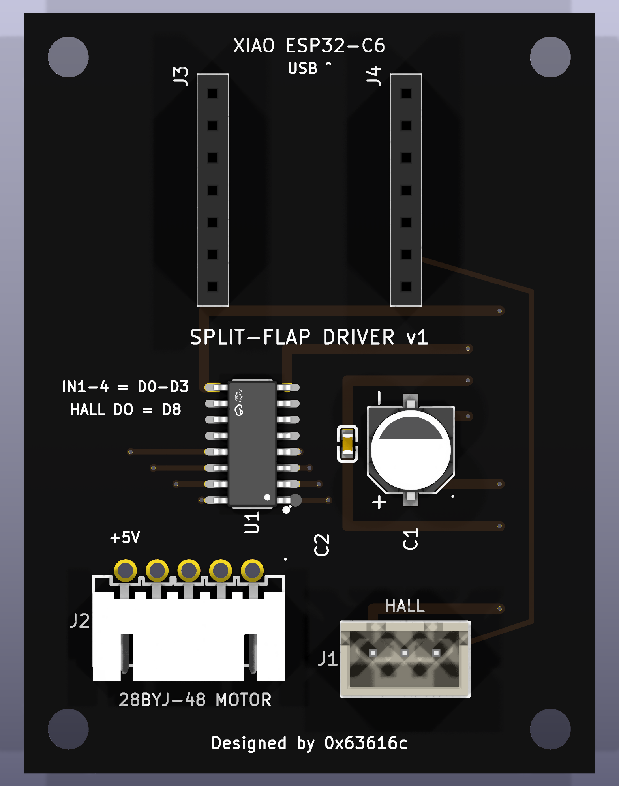

# split-flap driver board v1 — 28BYJ-48 / ULN2003

Single-module driver for the split-flap: a socketed **Seeed XIAO ESP32-C6**
drives a **ULN2003** Darlington array, which drives a 5-wire unipolar
**28BYJ-48** off USB 5 V. A 3-pin header takes the hall sensor.

45 × 60 mm, 2-layer, 1.6 mm FR4.

v2 (`../driver-board-nema/`) is the NEMA 14 / TMC2209 board — a separate
design, not a revision of this one.



## Pinout

| XIAO | Signal | Goes to |
|---|---|---|
| D0–D3 | IN1–IN4 | ULN2003 inputs |
| D8 | HALL DO | J1 pin 3 |
| 5V | +5 V | ULN2003 COM (the coils' flyback clamp rail) and J2 pin 5 |

D9/D10 are socketed but unrouted.

> **The hall line floats when no magnet is present.** An open-collector output
> is high-Z when it is not pulling down, and nothing on this board pulls it
> up. Firmware **must** enable the XIAO's internal pull-up on D8 or it will
> read noise.

### Connectors

| Ref | Type | Pinout |
|---|---|---|
| J2 | JST-XH 5-pin | 28BYJ-48 motor. Pins 1–4 are OUT1–OUT4; pin 5 is the motor common (red wire), marked `+5V` on the silk |
| J1 | JST-XH 3-pin, vertical | `5V GND DO` — hall sensor |
| J3 / J4 | 1×7 female receptacles, **15.24 mm apart** | XIAO socket — the module brings the male pins |

## Assembly notes

SMD first, tallest through-hole last:

1. **U1 (ULN2003, SOIC-16)** — easiest with nothing else in the way.
2. **C1 (220 µF) is polarised**: pin 1 is **+**. There is a `+` and a `−` on
   the silk just outside the can at each end, as well as the original pair
   under the body (which you cannot see once the part is fitted).
3. Sockets J3/J4 (**female** receptacles). Seat them square; a tilted socket
   makes the module sit crooked.
4. Connectors J1, J2 last.

The four M3 mounting holes are real **NPTH pads**, so they appear in
`filled-NPTH.drl` and get drilled to drill tolerance. They used to be inner
Edge.Cuts circles: a fab does cut those, but the non-plated drill file came
out empty, so nothing in the package actually declared them as holes.

## What to order

`fab-splitflap-driver-v1.zip` → PCBWay, 2-layer, 1.6 mm FR4, HASL or ENIG,
any colour. Components: `fab/bom.csv` — every part is LCSC-stocked and pinned
by part number. The XIAO plugs into its socket and is not soldered down.

## Building this from source

```
ato build                                    # twice after adding a component
tools/build_outputs.sh                       # place, route, DRC, renders, fab
tools/build_outputs.sh --quick               # place + DRC only
```

Placement and routing are address-keyed data tables in
`tools/place_and_render.py`, so they survive designator reshuffles. It
self-checks placement numerically (body/courtyard overlap, off-board,
pad-to-pad) and normalises every silk stroke to PCBWay's 0.15 mm minimum
before writing anything.

### DRC status

> ### ⚠ DRC the derived board, not `layouts/`
>
> `layouts/default/default.kicad_pcb` is atopile's, and `kicad-cli
> --save-board` rewrites it in a dialect faebryk's parser rejects. The real
> board is `build/filled.kicad_pcb`, which `tools/build_outputs.sh` derives;
> DRC, gerbers, drill, placement and renders all come from that copy. Just run
> `tools/build_outputs.sh`.

**0 errors, 0 warnings, 0 unconnected pads, 0 footprint errors.**

The build also promotes KiCad's courtyard rules. `missing_courtyard` and
`courtyards_overlap` ship as *ignored* checks, which means a board with no
courtyards at all passes cleanly while the body-overlap check never runs.
`build/filled.kicad_pro` turns both into errors, and `../tools/verify_fab.py`
independently re-checks courtyards, board extents, silk width and
silk-over-mask-opening numerically on the exported board.
